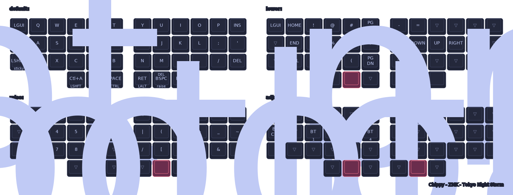

# Chippy ZMK Config (Corne 3x6+3 / XIAO BLE)

This repository contains a ZMK firmware configuration for a split Corne-style keyboard named **Chippy**.

## Hardware Target

- Split keyboard, Corne-style
- 3 rows x 6 columns per half
- 3-key thumb cluster per half
- XIAO BLE MCU
- No display
- No RGB

## Project Goals

- Keep the layout simple and reliable
- Preserve battery life and avoid unnecessary features
- Optimize for terminal-heavy workflows (`zsh`, `nvim`, `tmux`, Codex CLI)
- Keep alpha layout on QWERTY
- Use ZMK-native behavior and modules only

## Source Of Truth

- Keymap: `config/chippy.keymap`
- Runtime config: `config/chippy.conf`
- Build matrix (CI): `build.yaml`
- West manifest: `config/west.yml`

## Layout Summary

- **Default layer**: QWERTY base + ergonomic thumbs/mods
- **Lower layer**: navigation/editing/media-adjacent keys
- **Raise layer**: numbers + symbols tuned for coding
- **Adjust layer**: Bluetooth profile management and bootloader access
- **Tri-layer**: `LOWER + RAISE -> ADJUST`

## Custom ZMK Module In This Repo

This repo includes an in-tree custom module under `config/`:

- `config/zephyr/module.yml`
- `config/CMakeLists.txt`
- `config/Kconfig`
- `config/dts/bindings/behaviors/zmk,behavior-bt-profile-report.yaml`
- `config/src/behaviors/behavior_bt_profile_report.c`

### Custom behavior: `bt_profile_report`

When triggered, it types:

`Profile BT <digit>`

The digit is derived from the active BT profile (1-based for readability).

Notes:

- Behavior is centralized (correct for split BLE central/peripheral architecture)
- Peripheral half safely no-ops for this behavior

## Build (Local, Docker)

- `make build` -> builds both halves + keymap SVG
- `make build-left`
- `make build-right`
- `make keymap-image`
- `make update`
- `make rebuild`

## Build Artifacts

- Left UF2: `build/artifacts/chippy_left-xiao_ble-zmk.uf2`
- Right UF2: `build/artifacts/chippy_right-xiao_ble-zmk.uf2`
- Rendered keymap: `build/artifacts/keymap.svg`

## Current Rendered Keymap

Open directly: [build/artifacts/keymap.svg](build/artifacts/keymap.svg)

## CI / Canary

GitHub Actions uses:

`zmkfirmware/zmk/.github/workflows/build-user-config.yml@main`

with matrix from `build.yaml`, so upstream `main` breakages are detected early.

## Flashing

Flash each half with its corresponding UF2:

- Left half -> `chippy_left-xiao_ble-zmk.uf2`
- Right half -> `chippy_right-xiao_ble-zmk.uf2`

## Bluetooth Operational Notes

- `BT_SEL` is 0-based (`BT_SEL 0` = profile 1)
- If pairing loops (`connect/disconnect`), clear bonds on both keyboard profile and host side, then pair again
- `xiaoReset.uf2` is intentionally kept for recovery/reset workflows
